## Create a fully functional mobile application with DAB

Let's see how we can create a fully functional mobile application that utilises MFP security and invokes a backend, engages with end users - all with minimal application coding, using DAB.

>Note: All images used in this sample can be found in [Artifacts](../Artifacts/images) directory.
> Adapters will be in [Adapters](../Artifacts/Adapters) directory. Code snippets are available at [Code Snippets](../Artifacts/Code_snippets)
> You can clone this git repo if you intend to work offline.

You can launch the Digital App Builder from:

* In **MacOS**, double click the **IBM Digital App Builder icon** to open the Digital App Builder.
* In **Windows**, launch the Digital App Builder by selecting **Start > Programs > IBM Digital App Builder**.

>**Note**: If you are opening the Digital App Builder for the first time, **Accept** the **License to use IBM Digital App Builder** in the flash screen to proceed further. After accepting the license agreement, the **Prerequisites Check** runs automatically for the first time. Click **OK** to proceed, if no errors found otherwise fix the errors and then restart the Digital App Builder.

You can **Create new app** or **Open an app** or use the available Templates to further build your app.
>**Note**: You can see your recently created app under **Recent** section. For new installation, you will not be seeing the **Recent** section.

### Create a new app

You can create a new app by clicking **Create new app** icon from the Builder dashboard.

1. Click **Create new app** icon. This will display the **Select Channel** window.

    

2. Select the channel for which you want to develop the app, by clicking the respective icon. You can later add more channels to the same app.

    * **Android**: Select this option if you are creating an android app.
    * **iOS**: Select this option if you are creating an iOS app.
        >**Note**: You can build and run the iOS apps only on MacOS.
    * **Web**: Select this option if you are creating the app for the Web.
    * **PWA**: Select this option if you are creating a Progressive Web App.

3. The **Select type of server to connect to** window is displayed.

    

4. Chose **Custom Professional Server**.
    
    * **Custom Professional Server** – You can connect to your own Mobile Foundation server either created on IBM Cloud or local. In the **Configure IBM Mobile Foundation instance** window you can either select an existing server or create a new server.

        >**Note**: Start the IBM MobileFirst Developer Kit server if not already done.
        
        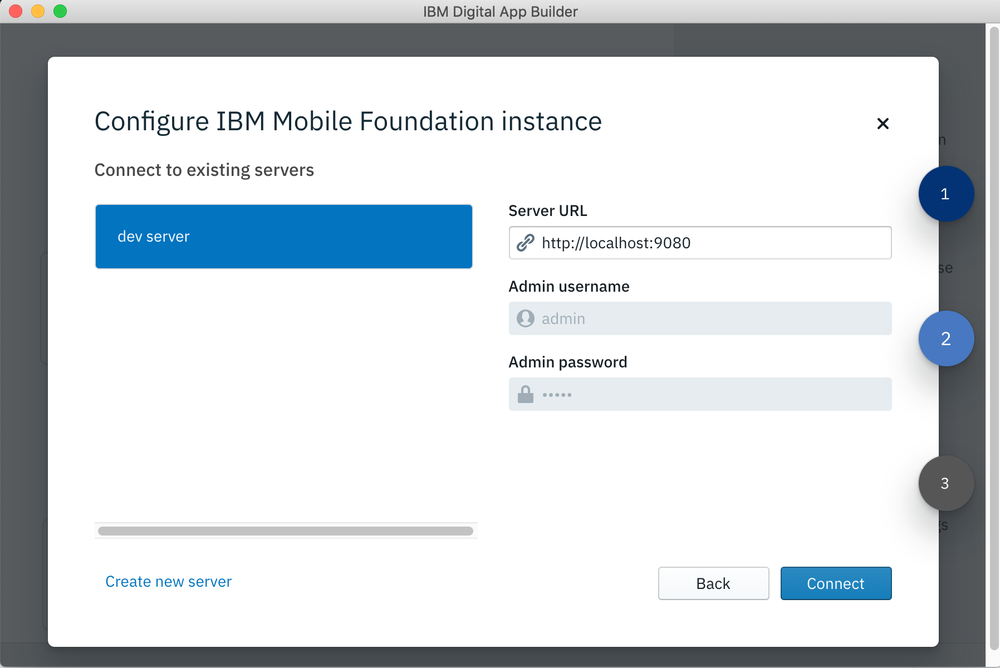
 
        * Enter the new IBM Mobile Foundation instance details, like **Server name**, **Server URL**, **Admin username**, **Admin password**.
            >**Note**: For IBM MFP Developer Kit server, you can enter the local hostname and port as 9080. Use **admin** as the username and **admin** as the password. 

        * Click **Connect**.

5. On successful login/connect, the **Create App** window is displayed where you can select an existing app definition that you may have created or create a new one by entering the details. 
    * For a new app provide: **Name** of the application, **Location** where the project files will be stored, **Project/Bundle Id**, and **Version** of the application. 
 
        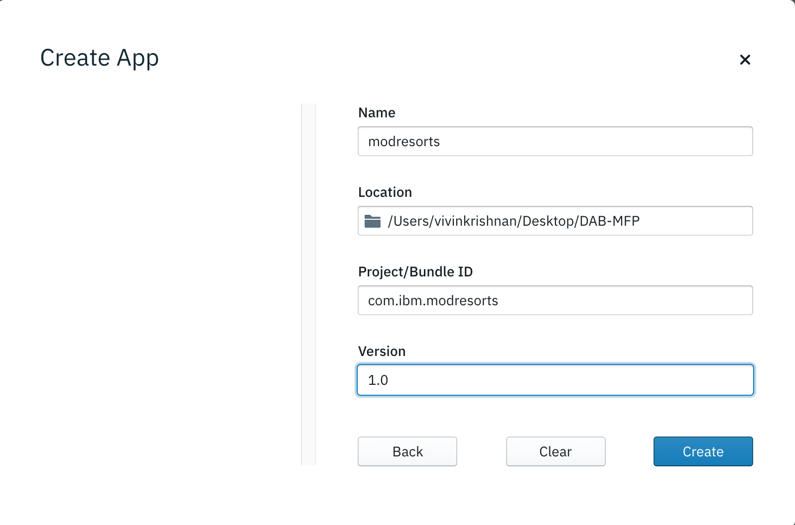

    * Click **Create** to create the application. This displays the **Select Mode** window. With Design mode one can design the application by dragging and dropping UI elements and modify properties. With Code mode , a developer can use work with application layer, html and css. Chose Design mode to begin with.

    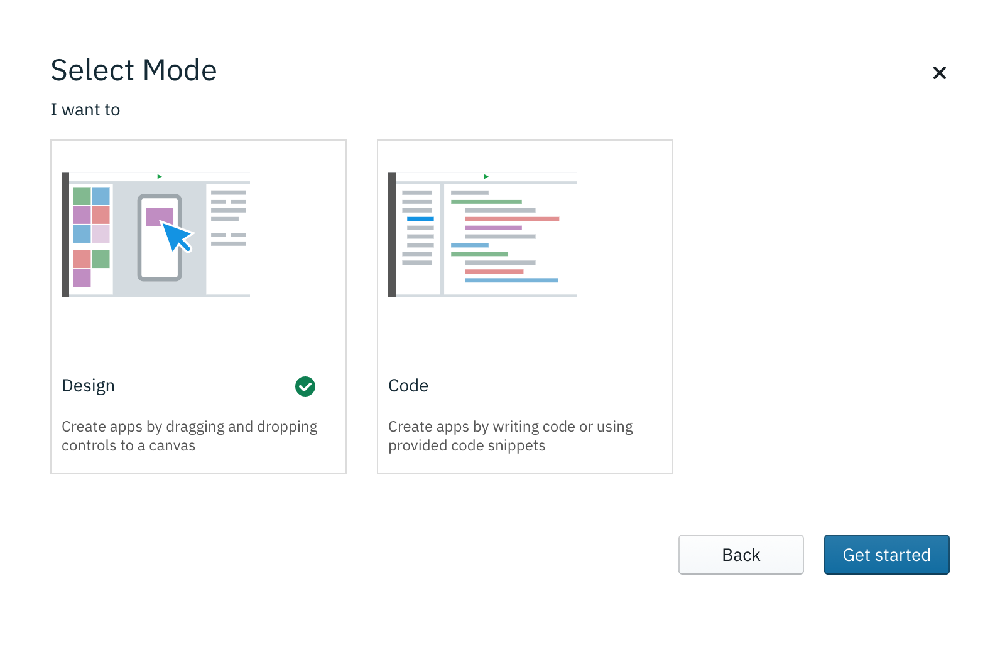
    
    
    * Click **Get started**. This opens the Digital App Builder workspace for creating a new application.

        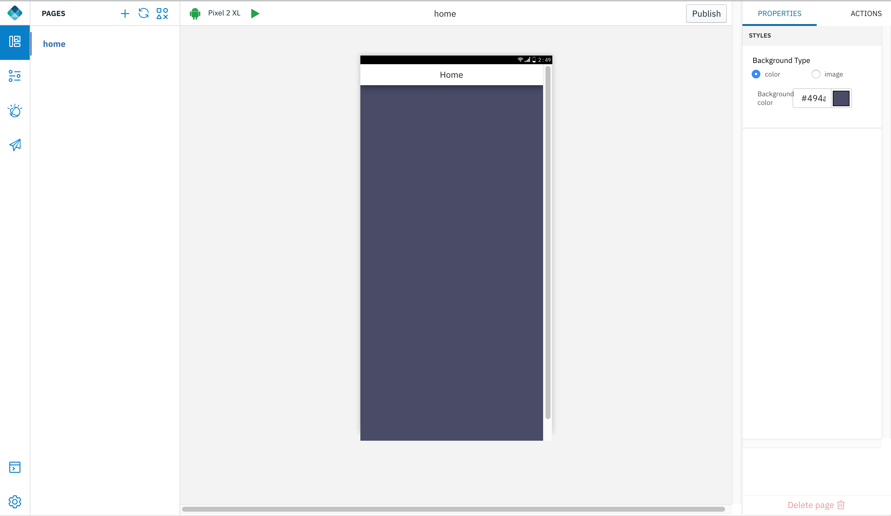

6. Give a background image to the home page. 

   >Note: All the images can be downloaded from [DAB modresorts images](../Artifacts/images)	
   
   From the "Show Controls" option, drag and drop an image control. Chose an image for a logo. Save.

	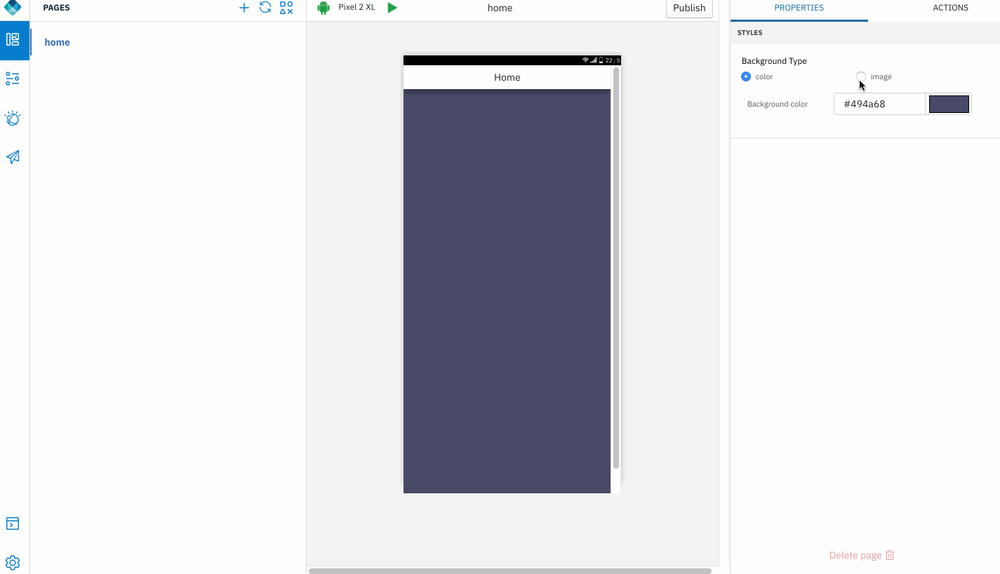

7. Create a few more pages :

		1. landingpage
		2. resortslist
		3. weatherlist
		4. chatbot 	

   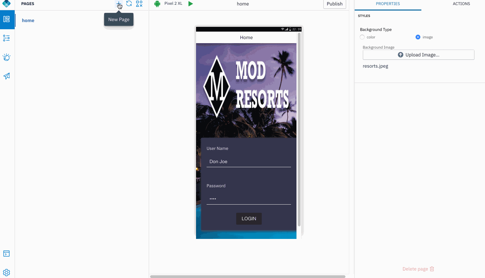			
      
8. Back in home page, from the "Controls" option, drag and drop a Login control. From the dropdown list of Security check names, chose "UserLogin".  For "On Login Success" , chose the page "landingpage". If the login validation succeeds, the application flow will automatically navigate to this page. Save.
	   
	 >Note: The Security check name dropdown list will be populated only if the MobileFirst server configured earlier has been started and security check adapter has been successfully deployed. Security check adapter can be found in the "Artifacts/Adapters/UserLogin/target" folder. Learn how to deploy adapters, [here](http://mobilefirstplatform.ibmcloud.com/tutorials/en/foundation/8.0/adapters/creating-adapters/#downloading-or-deploying-adapters-using-mobilefirst-operations-console).  
	 
	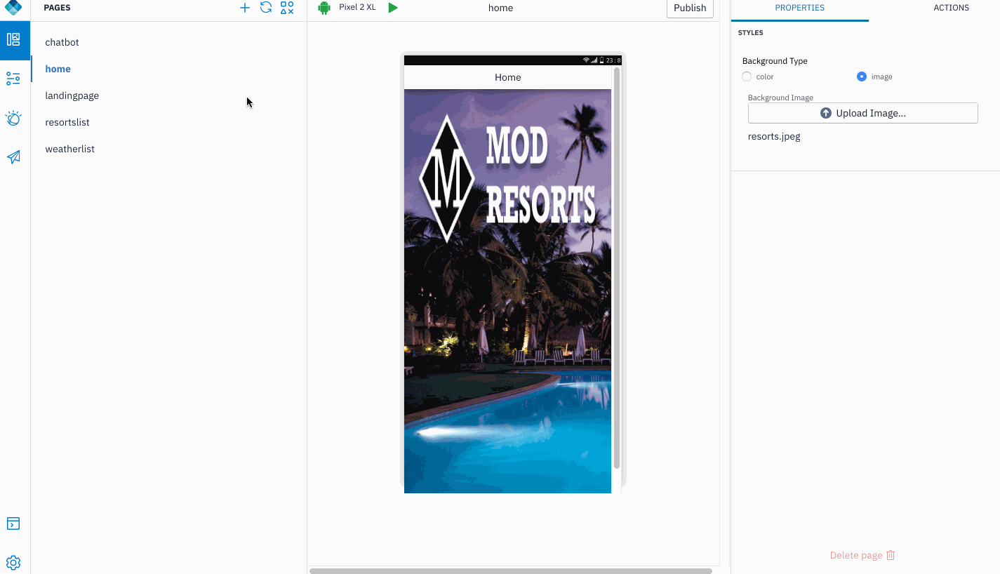
	  
9. Click the newly created "landingpage". Add a background image and a logo image. Then add three images that will serve as controls.

	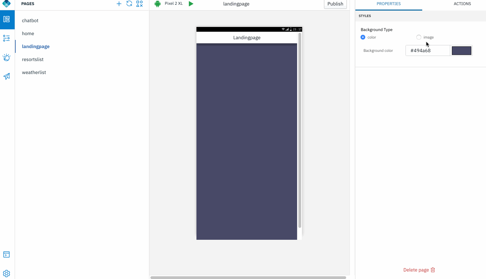

10. Similarly, select "resortslist" and "weatherlist" pages to add a background.

	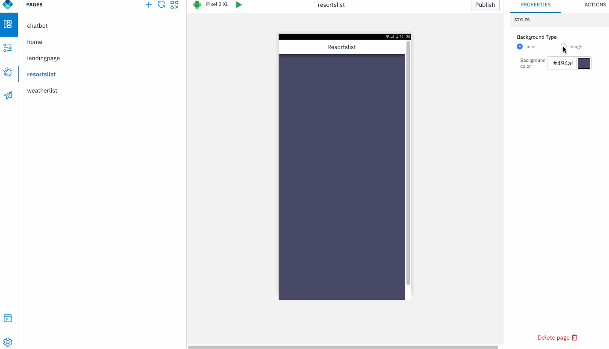

11. Back in "landingpage", we will add click handlers to the images. This will define what happens when the image is clicked.

	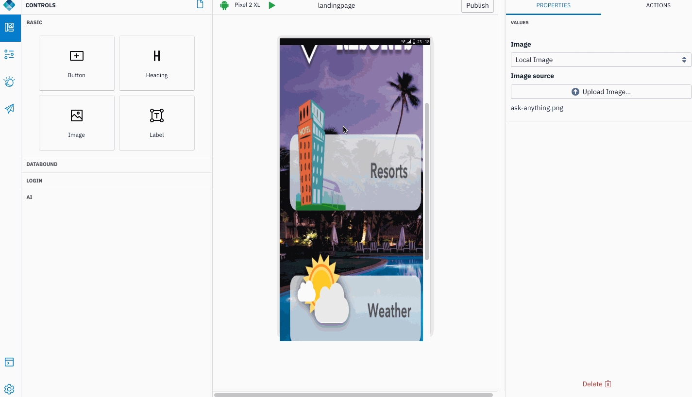
	
12. Click "Live Preview" to preview the design so far. Login and click on the images to see the actions fire.

	>Note: To login, enter any string as the username and the same as password. 	For instance, if username is `user`, password must be `user`.

	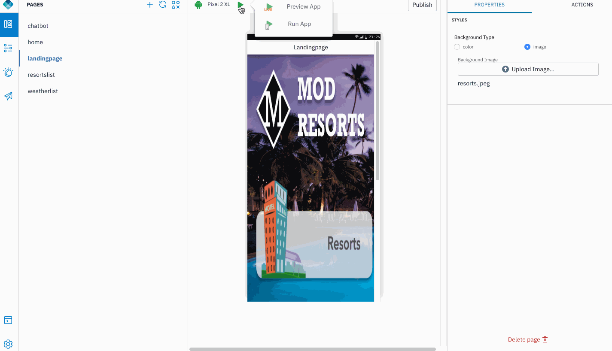

-------------
Want an AI enabled chatbot? Let's add some AI & Cognitive capabilities with [IBM Watson Chat](../2-watson-chatbot)
