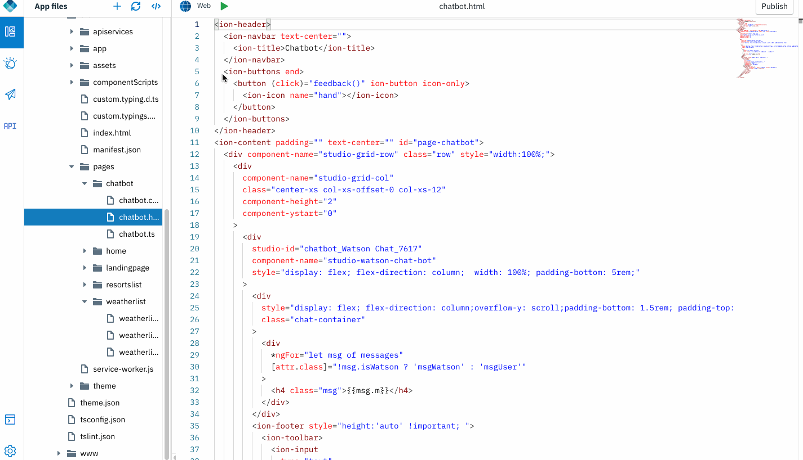
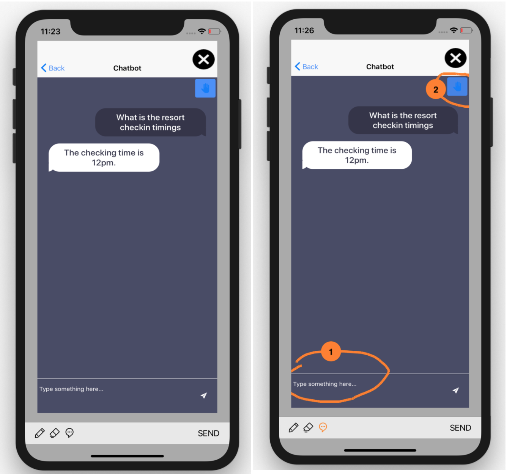
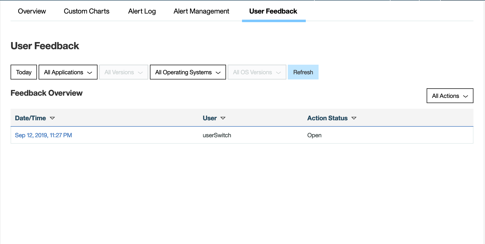
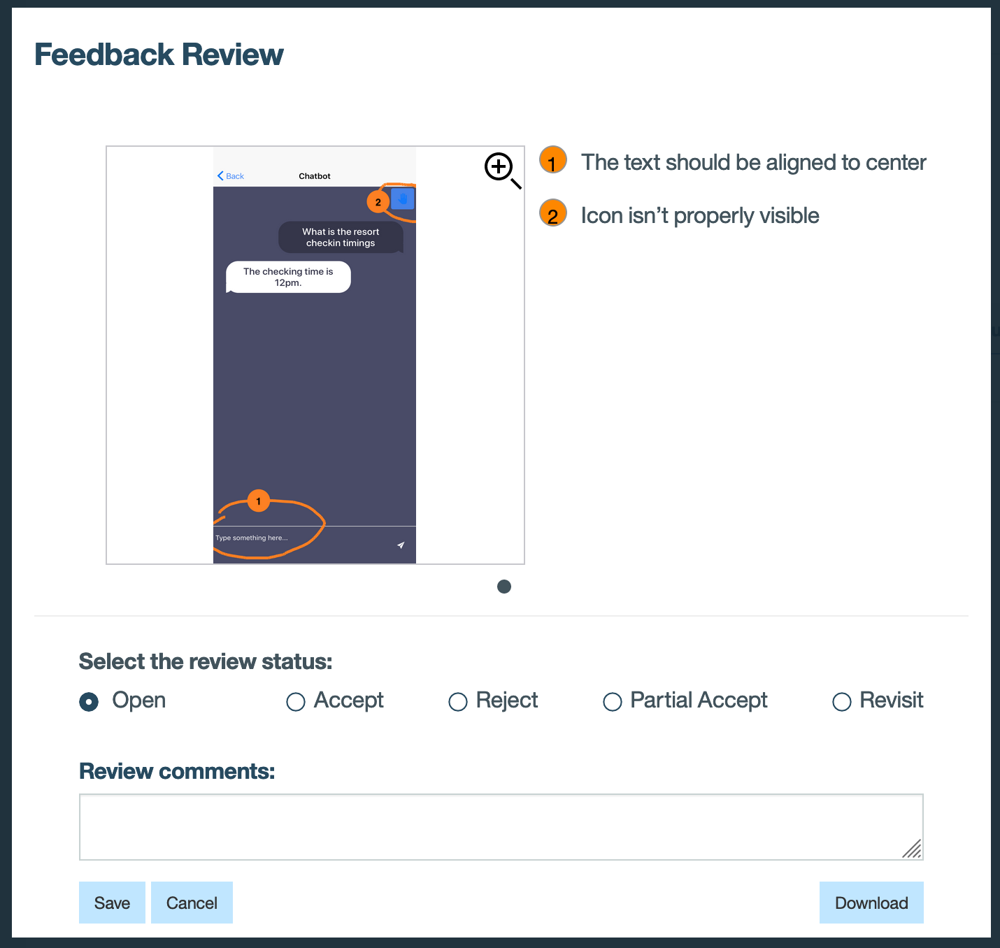

## InApp Feedback 

Wish to listen directly from the end users, on what they think of a new feature? MFP and IBM Digital App Builder brings you InApp Feedback, that allows end users to provide feedback about a specific page or feature in your application. You can collect the user feedback in your Analytics server and provide it to your development teams for continued improvement.

Let's see how end users are reacting to your new Watson Chatbot addition:

### Open an app

1. Open an application that was exported from Design mode, or previously created in Code mode. Click **Open new app** icon. 

    
    
2. Let's give a button for end users to give feedback. 


3. Add a button in the chatbot page.Edit the chatbot.html page:

	```javascript
	<ion-buttons end>
	    <button (click)="feedback()" ion-button icon-only>
	      <ion-icon name="hand"></ion-icon>
	    </button>
   </ion-buttons>
	```

2. Add the *feedback()* method , drag and drop "User Feedback" code snippet.

	
    
3. Run the application, navigate to chatbot page. Click on the feedback button  added,to give a feedback. 

	

4. Navigate to Analytics console, "User Feedback" tab. View the user feedback here.

	

5. Assign action to a developer based on the feedback received

	


-----------

Ready to publish your application to a wider audience or team for testing? Publish the application binaries to your in-house enterprise application store  - [IBM MFP Application Center](../11-application-center).
