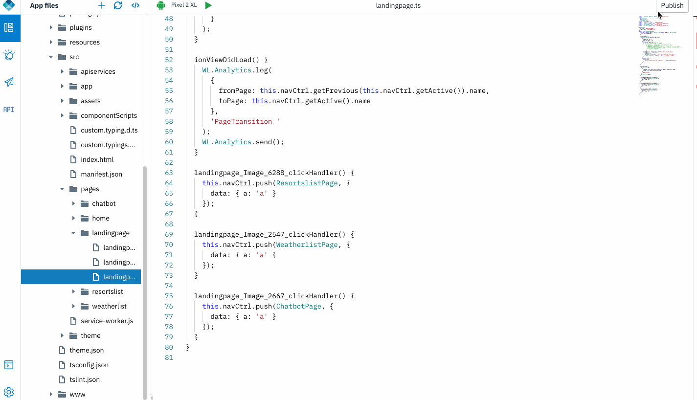
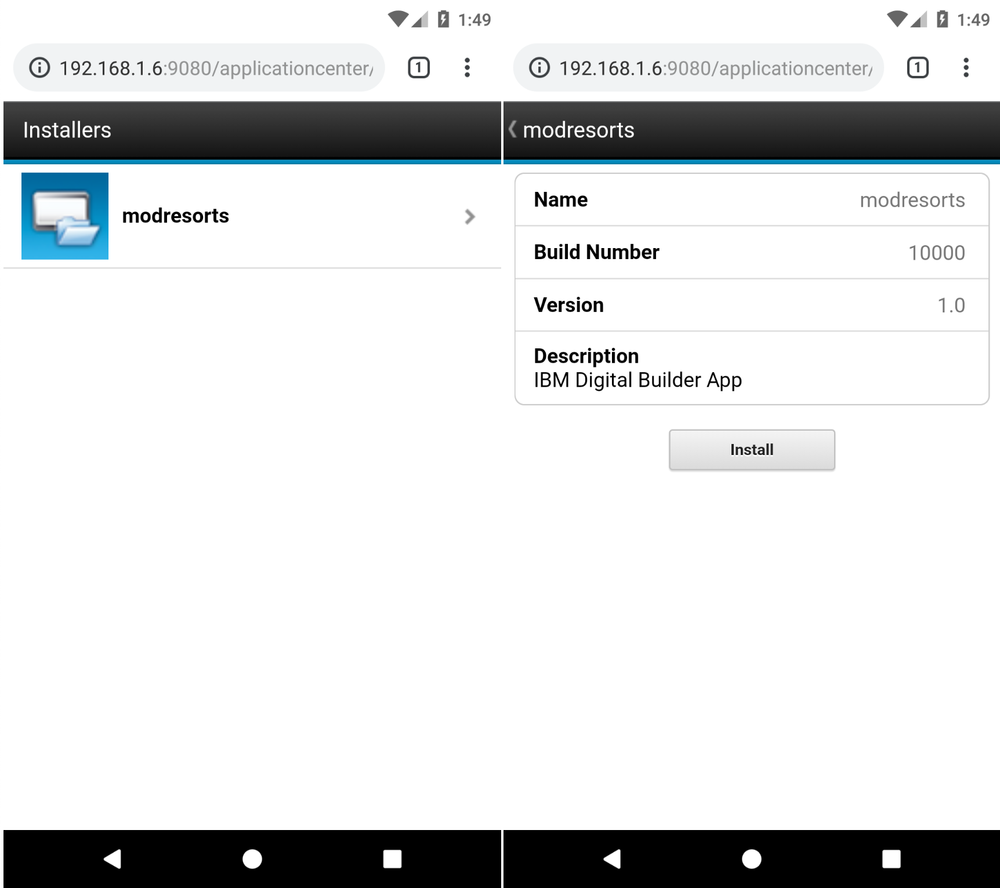

## IBM Application Center

[Application Center](https://mobilefirstplatform.ibmcloud.com/tutorials/en/foundation/8.0/appcenter/) can be used as an Enterprise application store and is a means of sharing information among different team members within a company.

The concept of Application Center is similar to the concept of the Apple public App Store or the Android Market, except that it targets only private usage within a company.

By using Application Center, users from the same company or organization download applications to mobile phones or tablets from a single place that serves as a repository of mobile applications.

### Open an app

1. Open an application that was exported from Design mode, or previously created in Code mode. Click **Open new app** icon. 

    

### Publish the application binary to Application Center
    
1. Select the "Publish" option. 

	

2. Scan the QR code to install the application directly from AppCenter.

3. Alternatively, the application can be installed via Application Center installers page in your device browser. 

	