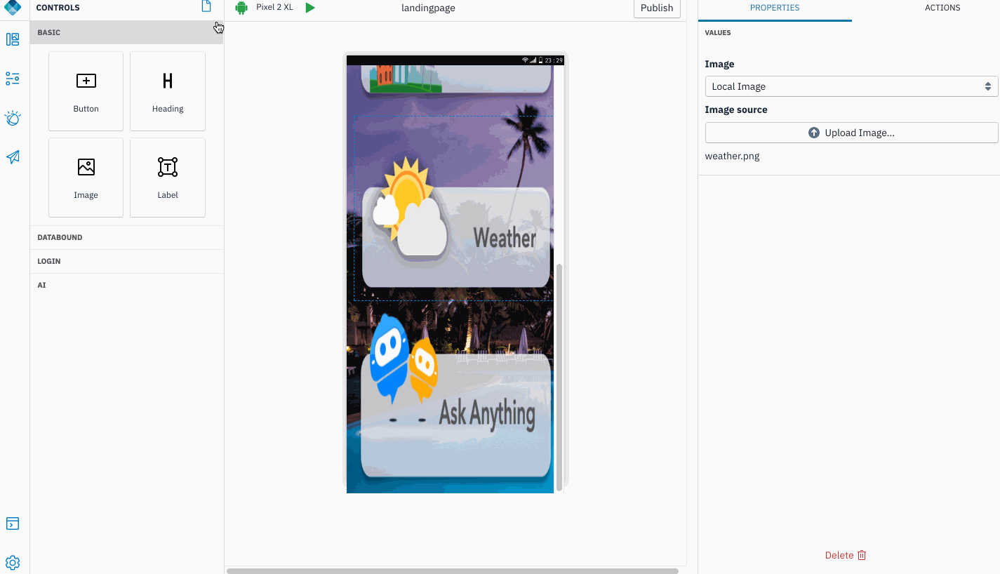
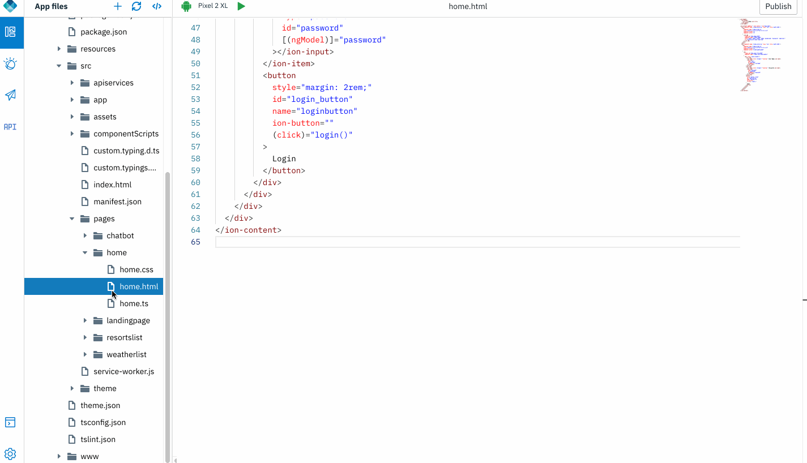

## Code mode

IBM Digital App Builder supports a code only mode intended for advanced users. With Code mode, a user can switch to a code only view and work directly on the application logic, editing html or css.

>Note: Once you have switched to code mode, you cannot switch back to design mode.

### Open an app

1. Open the application project.
	
## Start developing application logic in Code mode

### Exporting to code mode

1. Export the project. *File -> Export to Code*. Chose an output folder

	

2. Open the application that was exported from Design mode, or previously created in Code mode. Click **Open new app** icon. 

    
    
2. Go through the project in code mode. 

	    

----------
Ready to invoke backend services? Before that , would you like to test your UI and its responsiveness with some Mock API backends?
We can now proceed to [invoking a Mock API backend](../4-mock-api)	
