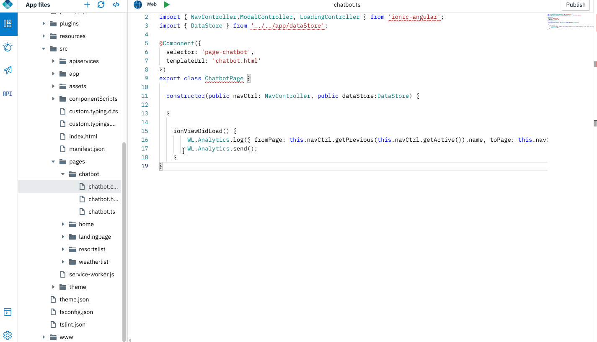
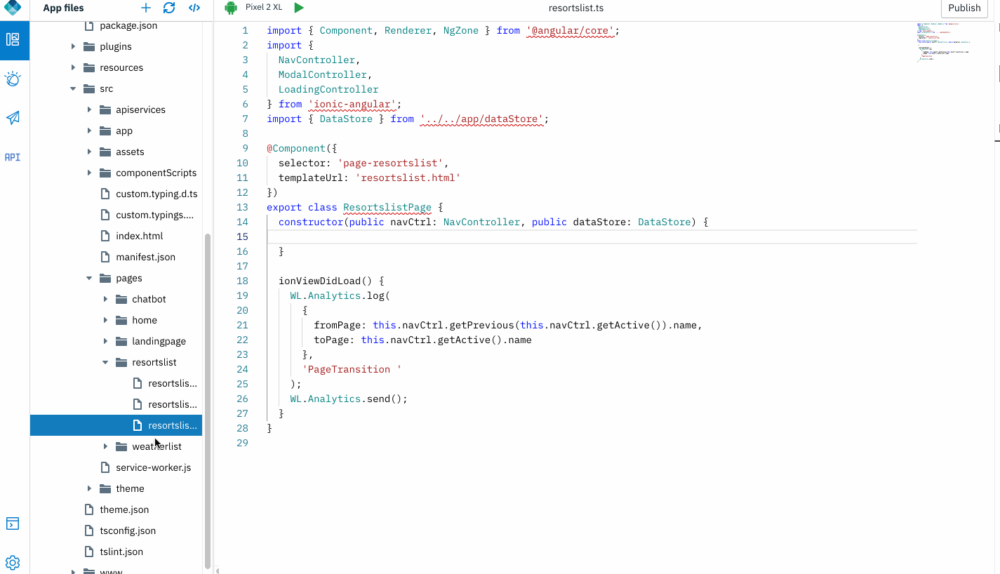
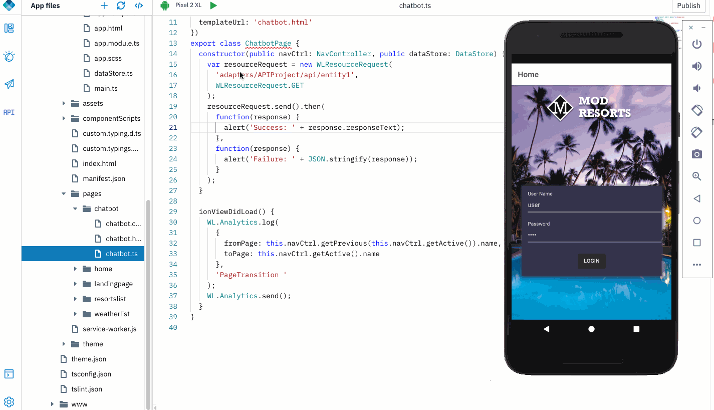

## Mock backend REST APIs using Mock API

Want to test application functionality with Mock REST backends? Wish to quickly develop your front end by simulating the response from the backend without having to actually connect to the real backend? Use Mock API feature.

### Open an app

1. Open an application that was exported from Design mode, or previously created in Code mode. Click **Open new app** icon. 

    

### Create a Mock API
    
1. Create a Mock API. Define the mock response content. This deploys an API project into MFP server that responds with the defined response content.

	    

2. Select "resortslist" page and drag & drop code snippet to make an API call.

	
    
3. Modify the code snippet to point to the mock API endpoint defined.

	>Note: Refer the Mock API endpoint in DAB or Swagger to find the correct endpoint.
	
    ```javascript
    var resourceRequest = new WLResourceRequest(
      'adapters/APIProject/api/entity1',
      WLResourceRequest.GET
    );
    resourceRequest.send().then(
      function(response) {
        alert('Success: ' + response.responseText);
      },
      function(response) {
        alert('Failure: ' + JSON.stringify(response));
      }
    );
    ```  

4. Do a quick preview or run the application in an emulator or device to see the Mock API endpoint getting invoked.

    

-----------  

Proceed to invoke [an actual REST microservice](../5-microservice-invocation)
