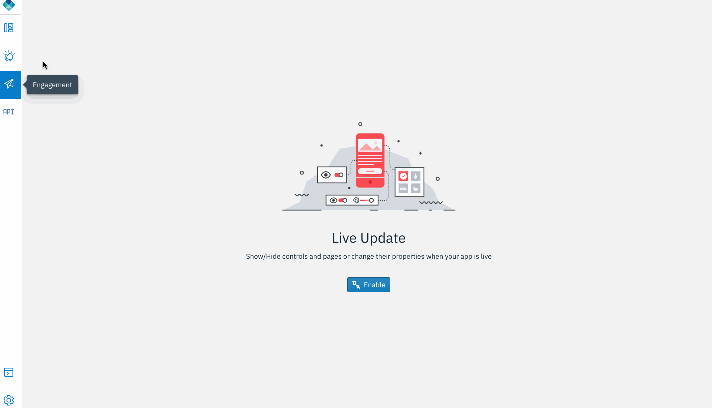
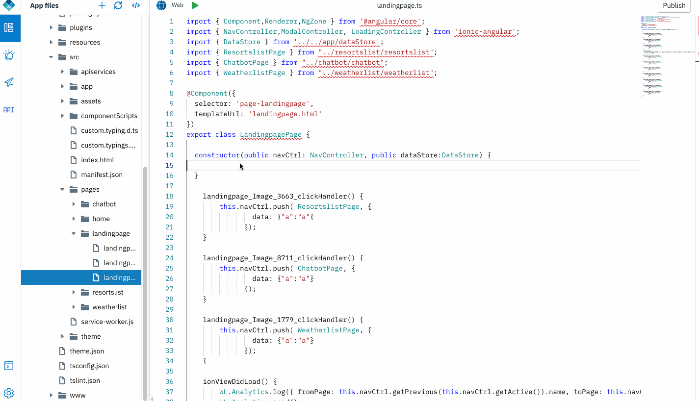
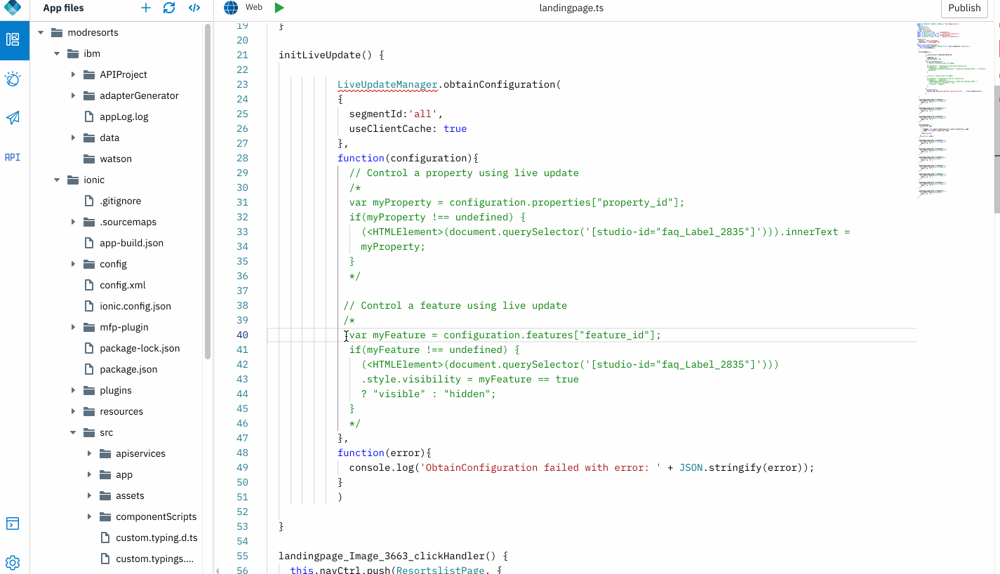
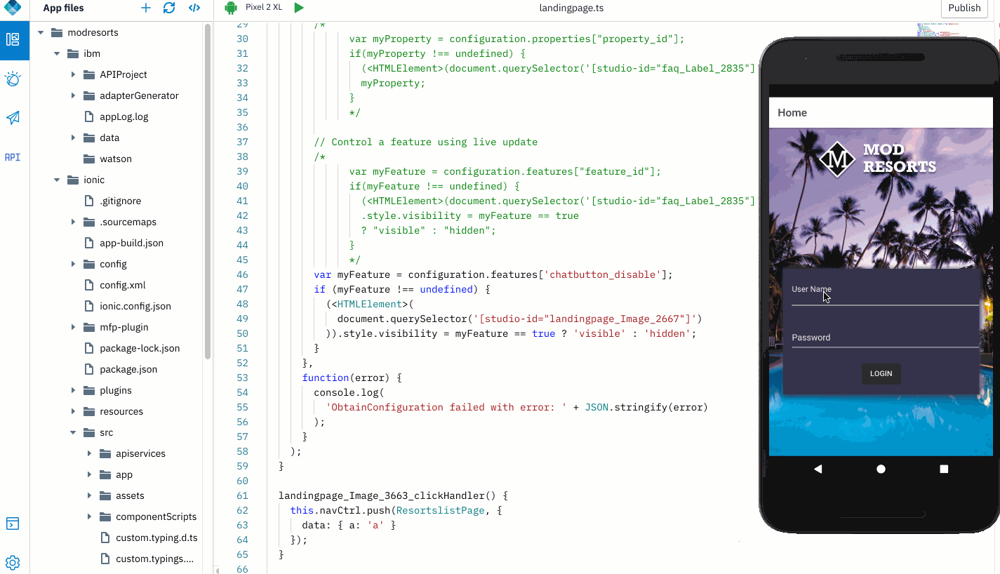

## Liveupdate to perform feature toggle

The Live Update feature in Mobile Foundation provides a simple way to define and serve different configurations for each segment of users of an application. 

### Open an app

1. Open an application that was exported from Design mode, or previously created in Code mode. Click **Open new app** icon. 

    

### Enable LiveUpdate
    
1. In the projct, navigate to Engagement -> Live Update. Enable.

2. Add a "New Feature". Define an id and a description 

	    

3. Open "landingpage.ts". Add a method in the constructor. Define the method and drap & drop LiveUpdate Feature Configuration code snippet.

	

4. Copy the commented out reference code snippet and start editing it.

	

5. Modify the code snippet to add the right feature id and HTMLElement identifier.
	
	>Note: Ensure you replace 'feature_id' with the id name you created while configuting Liveupdate. You can obtain HTMLElement's id from the respective html page.


	```javascript
	constructor(public navCtrl: NavController, public dataStore: DataStore) {
	    	this.initLiveUpdate();
	}
	  
	initLiveUpdate() {
	    LiveUpdateManager.obtainConfiguration(
	      {
	        segmentId: 'all',
	        useClientCache: true
	      },
	      function(configuration) {
	        // Control a property using live update
	        
	        var myFeature = configuration.features['chatbutton_disable'];
	        if (myFeature !== undefined) {
	          (<HTMLElement>(
	            document.querySelector('[studio-id="landingpage_Image_2667"]')
	          )).style.visibility = myFeature == true ? 'visible' : 'hidden';
	        }
	      },
	      function(error) {
	        console.log(
	          'ObtainConfiguration failed with error: ' + JSON.stringify(error)
	        );
	      }
	    );
	}
	```
			

6. Under Engagement -> Liveupdate, toggle the feature On/Off. Run the application on a device or emulator and observe the change in the application.

	>Note: Liveupdate feature toggle works only on a real device or emulator. Feature toggle does not work in Livepreview mode.  


	
	
-------------
Capturing business analytics and insights is very easy. To see end users' usage patterns within the app, let's capture some [Custom Analytics data](../9-custom-analytics)
