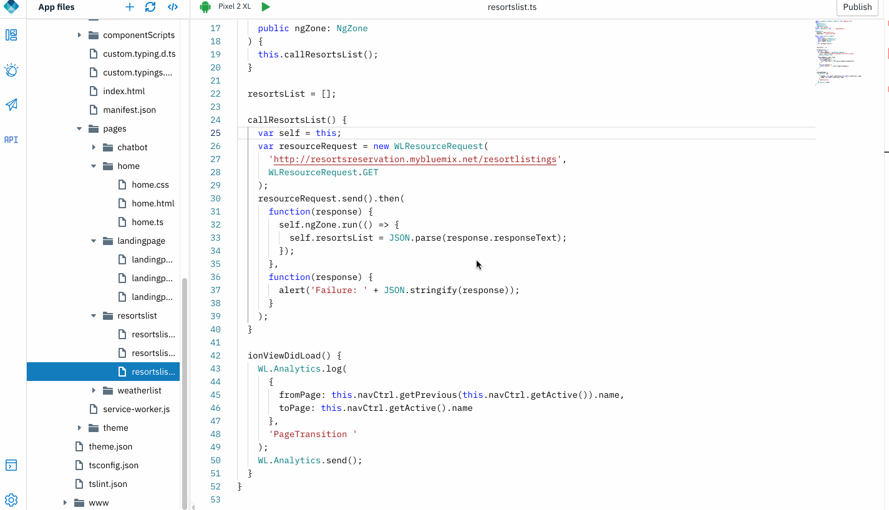
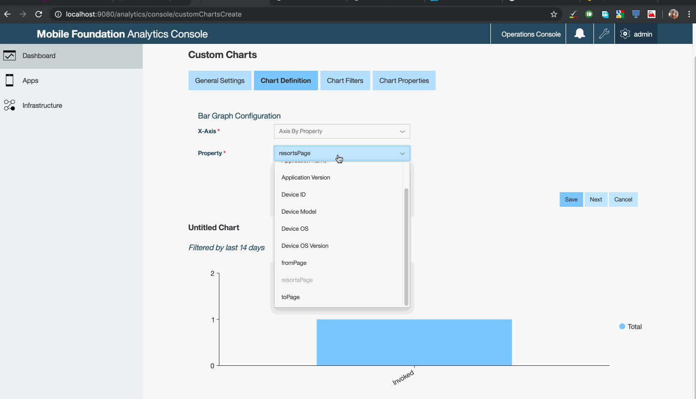

## Custom Analytics

Capturing Analytics data is critical to business growth. With MFP and Digital App Builder you can send custom analytics data to Analytics server to obtain more business insights. This can be used to find data such as - if users favour a specific page or a specific product in the line up.

### Open an app

1. Open an application that was exported from Design mode, or previously created in Code mode. Click **Open new app** icon. 

    

### Adding custom analytics data
    
A project created in DAB, already has code snippets that send custom analytics data ( page transition) to Analytics server. To add your own:

1. Navigate to "resortslist" page. We will add custom analytics data when the microservice is invoked. Within the `callResortsList()` method, drag and drop a "Custom Analytics" code snippet.

	 

2. Modify the code snippet to send some data to the server.

	```javascript
	WL.Analytics.log({ resortsPage: 'Invoked' }, 'resortsPage');
   WL.Analytics.send();
	```

3. Run the application in Live preview mode or on emulator/device. When the method is invoked data is sent to the server.

	
4. Login to MFP Analytics Console and verify if the custom analytics data is in Analytics server. 

 	>Note: This will need you to create a [custom chart](https://mobilefirstplatform.ibmcloud.com/tutorials/en/foundation/8.0/analytics/console/custom-charts/)

	 

-------------
Want an AI enabled chatbot? Let's add some AI & Cognitive capabilities with [IBM Watson Chat](../watson-chatbot)