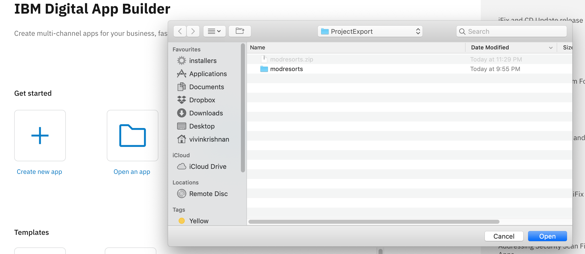
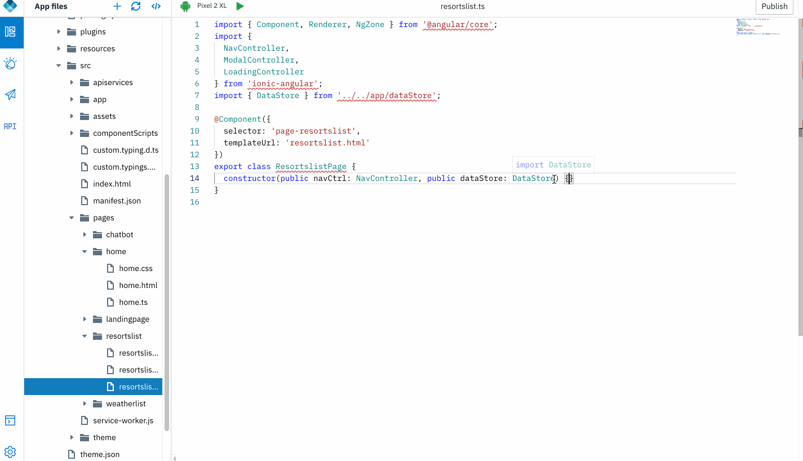
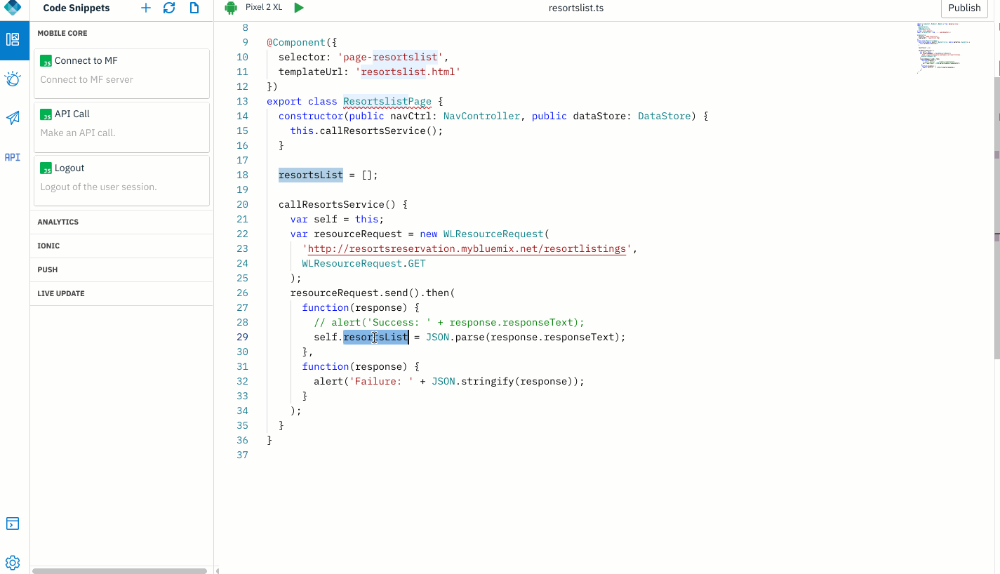
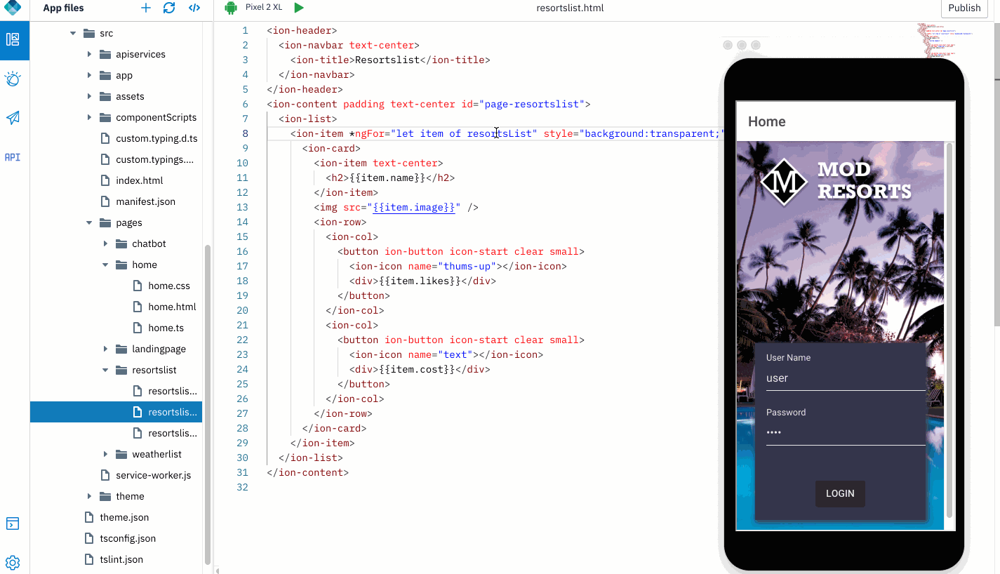

## Invoke backend REST microservices

Invoke a backend REST microservice. Obtain the response from the microservice and display it in your application.

### Open an app

1. Open an application that was exported from Design mode, or previously created in Code mode. Click **Open new app** icon. 

    

### Invoking backend Microservice
    
1. Open "resortslist" page. Add a method that will be invoked when the page loads.

	    

2. Drag and drop an API call code snippet into the method.

3. Modify the code snippet to invoke the microservice.

	```javascript
	 constructor( public navCtrl: NavController,public dataStore: DataStore,public ngZone: NgZone) {
	    	this.callResortsList();
	  }
	
	  resortsList = [];
	
	  callResortsList() {
	    
	   var self = this;
	   var resourceRequest = new WLResourceRequest(
	      		'http://resortsreservation.mybluemix.net/resortlistings',
	      		WLResourceRequest.GET
	   );
	   resourceRequest.send().then(
	        function(response) {
	        	self.ngZone.run(() => {
	          	self.resortsList = JSON.parse(response.responseText);
	        });
	   	  },
	      function(response) {
	        	alert('Failure: ' + JSON.stringify(response));
	      }
	    );
	    
	}
	```	
	
4. Open "resortslist.html". Here, drag and drop an ionic cards list UI element within the *ion-content /ion-content* tags.

	
	
	
5. Modify the html code snippet to:
	  ```javascript
	  <ion-content padding text-center id="page-resortslist">
	  <ion-list>
	    <ion-item *ngFor="let item of resortsList" style="background:transparent;">
	      <ion-card>
		<ion-item text-center>
		  <h2>{{item.name}}</h2>
		</ion-item>
		
		<ion-row>
		  <ion-col>
		    <button ion-button icon-start clear small>
		      <ion-icon name="thums-up"></ion-icon>
		      <div>{{item.likes}}</div>
		    </button>
		  </ion-col>
		  <ion-col>
		    <button ion-button icon-start clear small>
		      <ion-icon name="text"></ion-icon>
		      <div>{{item.cost}}</div>
		    </button>
		  </ion-col>
		</ion-row>
	      </ion-card>
	    </ion-item>
	  </ion-list>
	</ion-content>
	```

6. 	Preview the invocation of the backend microservice and the data appearing in a cards UI list view.

	
  
-----------  
Want to invoke microservice backends? Do not want to re-deploy adapters to change endpoints? 
We can proceed to [invoking a microservice via APIProxy now](../api-proxy)
