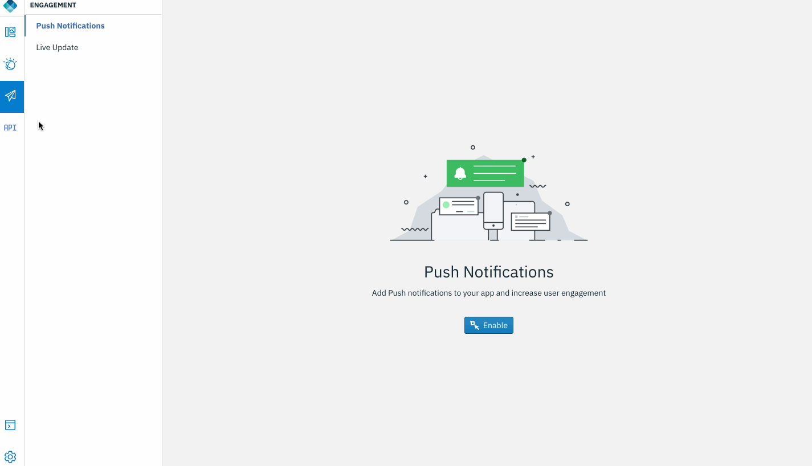
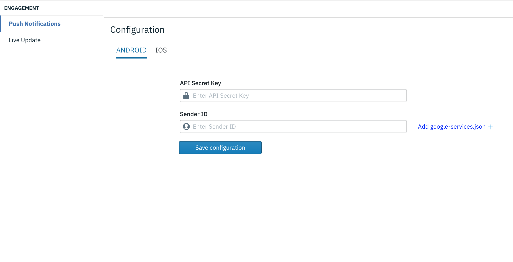
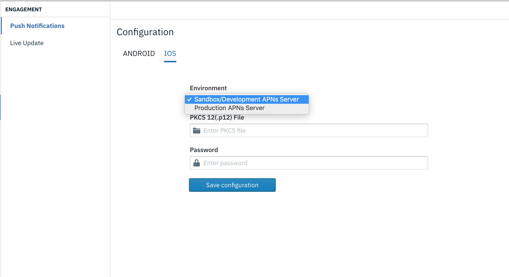
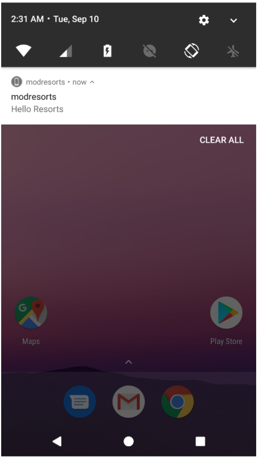

## Push notifications

Engage your end users with Push notifications. MFP and Digital App Builder powers you with unified APIs that allow you to send either push notifications to iOS and Android applications.

### Open an app

1. Open an application that was exported from Design mode, or previously created in Code mode. Click **Open new app** icon. 

    

### Enable Push notification feature
    
1. In the projct, navigate to Engagement -> Push Notifications. Enable.

	

2. Depending on your platform add the credentials or upload the APNS p12 certificate.

	
	

3. It is imperative that you add the google-services.json for FCM Push to work.

	Refer FCM configuration documentation on how to add your application id and obtain the json configuration : [FCM configuration](https://firebase.google.com/docs/android/setup#create-firebase-project)

	
4. Run the application on an emualator or a real device. Send a notification from MFP console.

	>Note: In case of Android, use a real device or Google APIs enabled emulator. For iOS, Push only works on a real device.
	
	

-----------

Wish to roll out a feature to a small segment of the customer base? Want to run it for a while and turn it off without pushing an application update?
Now it's time to perform some A/B testing and feature toggle using [Live Update](../liveupdate) 

