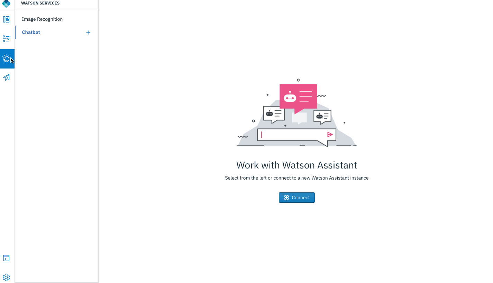
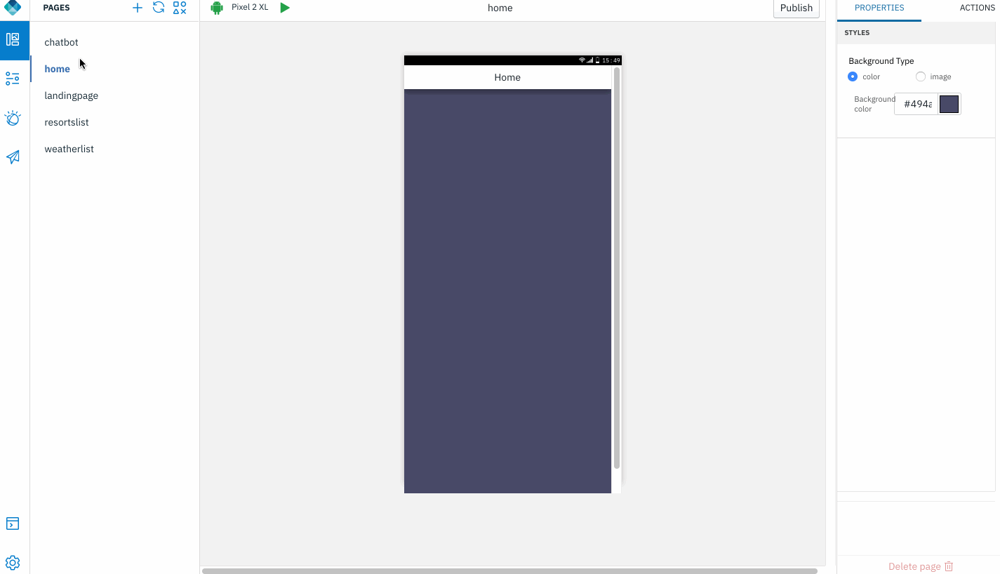

## Embed AI & Cognitive capabilities in your application

IBM Digital App Builder provides the ability to configure the app to connect and utilise IBM Watson services provisioned on IBM Cloud and enhance the end user experience with AI & Coginitive capabilities.

### Open an app

1. Open an application that was exported from Design mode, or previously created in Code mode. Click **Open new app** icon. 

    

### Enable and configure Watson Chatbot
    
1. Create a Watson Chat instance [here](https://cloud.ibm.com/catalog/services/watson-assistant).

2. Follow these instructions to configure and train Watson Chatbot from within Digital App Builder:

	[DAB Watson Chatbot](https://mobilefirstplatform.ibmcloud.com/tutorials/en/foundation/8.0/digital-app-builder/dab-interface/#chatbot)
	
	

3. Drag and drop Watson Chatbot under AI section to "chatbot" page.

	
    
4. Run the application, navigate to chatbot page. Enter a query for the chatbot to answer. 

	>Note: Chatbot responds based on the queries and answers you have trained it with. Provide more queries and answers to train your AI chatbot.

-----------

Wish to engage directly and get feedback from your end users? Enable [InApp Feedback](../inapp-feedback) in your application now.
